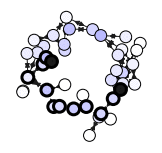
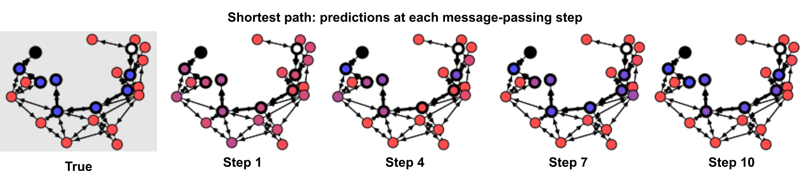

# Graph Nets library

[Graph Nets](https://github.com/deepmind/graph_nets) is DeepMind's library for
building graph networks in Tensorflow and Sonnet.

Contact graph-nets@google.com for comments and questions.


## Installation


(CPU)
```shell
$ pip install graph_nets "tensorflow>=1.15,<2" "dm-sonnet<2" "tensorflow_probability<0.9"
```

(GPU)
```shell
$ pip install graph_nets "tensorflow_gpu>=1.15,<2" "dm-sonnet<2" "tensorflow_probability<0.9"
```

To install the Graph Nets library and use it with TensorFlow 2 and Sonnet 2, run:

(CPU)
```shell
$ pip install graph_nets "tensorflow>=2.1.0-rc1" "dm-sonnet>=2.0.0b0" tensorflow_probability
```

(GPU)
```shell
$ pip install graph_nets "tensorflow_gpu>=2.1.0-rc1" "dm-sonnet>=2.0.0b0" tensorflow_probability
```

The latest version of the library requires TensorFlow >=1.15. For compatibility with earlier versions of TensorFlow, please install v1.0.4 of the Graph Nets library.

## Usage example

The following code constructs a simple graph net module and connects it to data.

```python
import graph_nets as gn
import sonnet as snt

# Provide your own functions to generate graph-structured data.
input_graphs = get_graphs()

# Create the graph network.
graph_net_module = gn.modules.GraphNetwork(
    edge_model_fn=lambda: snt.nets.MLP([32, 32]),
    node_model_fn=lambda: snt.nets.MLP([32, 32]),
    global_model_fn=lambda: snt.nets.MLP([32, 32]))

# Pass the input graphs to the graph network, and return the output graphs.
output_graphs = graph_net_module(input_graphs)
```


----------------

#### [Run "shortest path demo" in browser](https://colab.research.google.com/github/deepmind/graph_nets/blob/master/graph_nets/demos/shortest_path.ipynb)

The "shortest path demo" creates random graphs, and trains a graph network to
label the nodes and edges on the shortest path between any two nodes. Over a
sequence of message-passing steps (as depicted by each step's plot), the
model refines its prediction of the shortest path.



----------------
